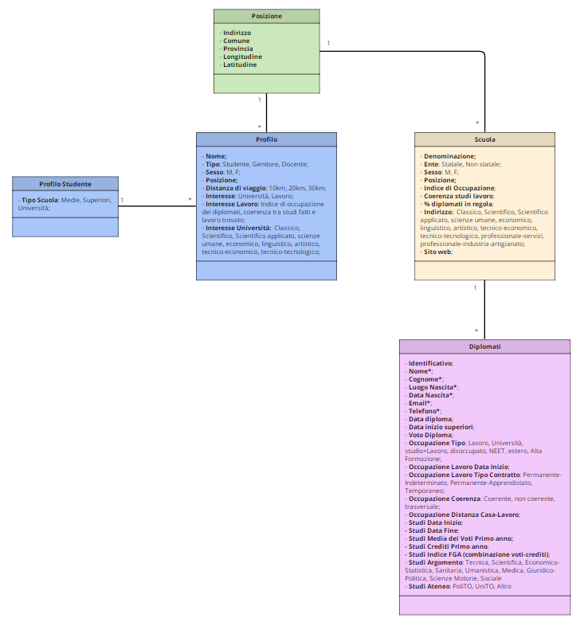

# Progetto

## Progetto iniziale:

>- Il sito che realizzeremo ci permetterà di trovare le scuole che corrispondono ai parametri scelti dall'utente. Gli allievi saranno in grado di essere contatti dalle aziende, grazie ai dati dei vari istituti.

 - Il progetto comprenderà due pagine:

>- La pagina "utente", dove si potrà avere accesso e l'utente sceglierà la scuola che più li si addice.
>- La pagina "amministrativa", dopo avere eseguito l'autenticazione a due fattori, il personale delle varie scuole potrà inserire i dati del proprio              istituto.
>- I parametri che l'utente dovrà inserire saranno: Nome; sesso; studi; città di residenza; la distanza e i propri interessi.
>- In seguito alla comparazione tra i vari istituti che corrispondono ai criteri selezionati, l'utente visualizzerà in ordine decrescente le scuole che meglio corrispondono ai bisogni indicati.

## Organizzazione e suddivisione del lavoro:
 - Il lavoro che andremo a svolgere verrà suddiviso principalmente in 4 fasi:

 > - Fase 1(Creazione del database): Eseguito Andrea Franco, Mattia Rughetta, Marco Defilippis, (2 ore di laboratorio).
   Mediante l'utilizzo dell'Entity Framework creeremo il database aiutandoci con il diagramma uml. 
    
 > - Fase 2(Pagina aministrativa): Eseguito da Mattia Rughetta,con l'aiuto del gruppo, (2 ore di laboratorio).
   Scriveremo il codice che serverà per l'inserimeto dei dati dalle varie scuole.
 > - Fase 3(Pagina utente): Eseguito da Andrea Franco, con l'aiuto del gruppo, (2 ore di laboratorio).
   Verrà creato l'algoritmo che confronterà i dati salvati nel database, mostrando all'utente le scuole che più coincidono ai criteri prescelti.
 > - Fase 4(Check-up finale del prodotto): Eseguito da tutti i membri del gruppo,
   Controlleremo il funzionamento dell'applicazione,trovando e correggendo eventuali errori, (1 ora di laboratorio)
 
## Documentazione del processo di realizzazione:
> - Per la documentazione del processo di realizzazione utilezzeremo il software "GitHub" e l' applicazione "GitHub Desktop",dove descriveremo tutte le modiche e le correzioni di eventuali errori utilizzando la funzione del "commit", aggiungendo titolo e descrivendo l'azione.

## Collegamenti e relazioni tra ciò che si sta realizzando e le informazioni di riferimento:
 - Il progetto che andremo a realizzare avrà dei collegamenti esterni con queste materie:
> - Sistemi e reti - Autenticazione a due fattori, per garantire la sicurezza dell'utente;
> - Tpsit - Creazione e gestione delle pagine in Html;
> - Telecomunicazioni - Protezione delle comunicazioni tra il database e l'host;
> - Educazione civica - Gdpr,il  regolamento generale sulla protezione dei dati; 
> - Per la realizzazione del nostro progetto utilizzeremo come base di riferimento la seguente [pagina](https://www.eduscopio.it/).
> - Il sito Eduscopio permette di conoscere le scuole che più rispecchiano i parametri inseriti dall'utente. 
 
- Gli argomenti trattati in teoria che verranno ripresi nella creazione di questa applicazione sono principalmente:
> - **Diagrammi UML** - Utili nella realizzazione e gestione dei database;
> - **Database** - Metodo di memorizzazione dei dati;
> - **Ereditarietà delle classi** - Utilizzate per la realizzazione del diagramma UML.

